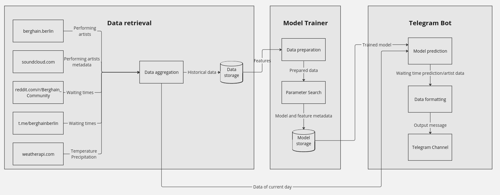

# BerghAIn

## Table of Contents
1. [Introduction](#introduction)
2. [Features](#features)
3. [Getting Started](#getting-started)
    - [Prerequisites](#prerequisites)
    - [Installation](#installation)
    - [Configuration](#configuration)
4. [Data Workflow](#data-workflow)
5. [Model Training](#model-training)
6. [Bot Operation](#bot-operation)
7. [Usage](#usage)
8. [Contributing](#contributing)
9. [License](#license)
10. [Acknowledgements](#acknowledgements)

## Introduction
This project predicts the queue times at Berghain, and publishes the results along with metadata about the artists performing. The predictions are based on data from various sources.
These include the official Berghain website, the unofficial Berghain telegram channel, discussions on the Berghain Community subreddit, weather data and SoundCloud.

## Features
- Retrieve data from multiple sources.
- Train a machine learning model to predict queue times.
- Publish predictions and artist metadata to a Telegram channel.

## Getting Started

### Prerequisites
- Python 3.7 or higher
- `pip` (Python package installer)
- [Telegram Bot API token](https://core.telegram.org/bots#3-how-do-i-create-a-bot)
- API keys for data sources (Weather API, SoundCloud, etc.)

### Installation
1. Clone the repository:
    ```bash
    git clone https://github.com/giovannicampa/berghAIn.git
    cd berghAIn
    ```

2. Install the required packages:
    ```bash
    python3 -m venv venv
    . venv/bin/activate
    pip install -r requirements.txt
    ```

### Configuration
1. Set up environment variables for your API keys and Telegram bot token.
    ```dotenv
    BOT_TOKEN=your_telegram_bot_token
    WEATHER_API_KEY=your_weather_api_key
    ```

## Data Workflow

<table>
  <tr>
    <td align="center">
      
      <br>
      <figcaption>The figure shows the data workflow</figcaption>
    </td>
  </tr>
</table>


1. **Data Retrieval**: Collects data from:
    - [Berghain website](https://www.berghain.berlin/)
    - [SoundCloud](https://soundcloud.com/)
    - [Subreddit: Berghain Community](https://www.reddit.com/r/Berghain_Community/)
    - [Telegram channel](https://t.me/berghainberlin)
    - [Weather API](https://www.weatherapi.com/)

    ```bash
    python3 src/data_exploration/data_exploration.py
    ```

2. **Data Preprocessing**: Clean and preprocess the collected data for model training.

## Model Trainer
1. **Training Data**: Use the retrieved and preprocessed data to train your prediction model.
2. **Model**: Describe the model architecture and training process.

How to train a model:

    ```bash
    python3 src/trainer/train_model.py
    ```

## Telegram Bot
1. **Real-time Data Retrieval**: Fetch live data for predictions.
2. **Predictions**: Use the trained model to make predictions.
3. **Publishing Results**: Send predictions and artist metadata to the Telegram bot.

    ```bash
    python3 src/bot/publisher.py
    ```

## Contributing
Contributions are welcome! Please open an issue or submit a pull request.

## Acknowledgements
- Thanks to the open-source community for the libraries and tools used in this project.
- Special thanks to the Berghain community for their data and support.
